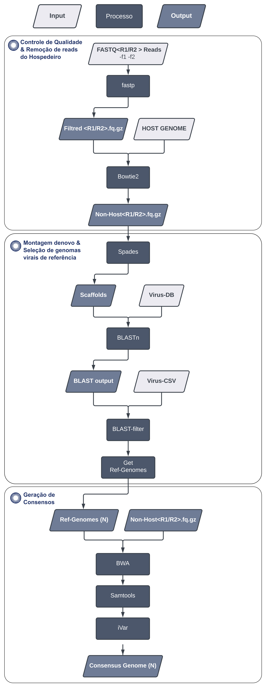

Bioinfotest - Desafio7
=========

Este repositório contém o fluxo de trabalho desenvolvido para resolução do desafio7.

=====
Dependências
=====

Todas as depências utilizadas podem ser instaladas diretamente com o ambiente conda desenvolvido para este desafio.

.. code-block:: text
   
   conda env create -f env/desafio7.yml
   conda activate desafio7
   
=====
Rodando a análise
=====

.. code-block:: text
   
   python path_to_code/code.py -r path_to_host_genome/host_genome.fa -vd path_to_virus_db_fasta/virus_db.fa -mt path_to_virus_db_metadados/virus_db.csv -f1 path_to_fastq_r1/sample_R1.fq.gz -f2 path_to_fastq_r2/sample_R2.fq.gz -p <num_threads> -m <mem_gb_value> -od <output_dir>
   
   #exemplo de análise que realizei
   python code.py -r ../data/hg19.fasta -vd ../data/virus_complete.fasta -mt ../data/virus_complete.csv -f1 ../data/Amostra03_R1_001.fastq.gz -f2 ../data/Amostra03_R2_001.fastq.gz -p 8 -m 8 -od ./amostra3
   
=====
Argumentos do script
=====

.. code-block:: text

  --ref_genome                 ### Arquivo fasta do genoma do hospedeiro, para excluir os reads das análises de montagem
  --vir_database               ### Arquivo fasta com genomas virais, para o desafio, usei os genomas presentes no refseq do ncbi virus
  --vir_metadata               ### Arquivo csv com as informações dos genomas virais, contendo as colunas: Accession,Isolate,Species,Genus,Family,Host, pode ser automaticamente recuperado na plataforma ncbi virus
  --fastq_r1                   ### Arquivo FASTQ com reads R1
  --fastq_r2                   ### Arquivo FASTQ com reads R2
  --threads                    ### Número de threads a ser usado nas análises
  --mem_gb                     ### Número de Gb de RAM a ser usado nas análises
  --cut_off                    ### Valor mínimo de bases para scaffolds serem considerados nas análises, default = 1000
  --outdir                     ### Diretório de output, caso não seja passado, o código da amostra será usado como valor.
  --prefix                     ### Prefixo a ser utilizado no nome dos outputs, caso não seja passado, o código da amostra será usado como valor.
